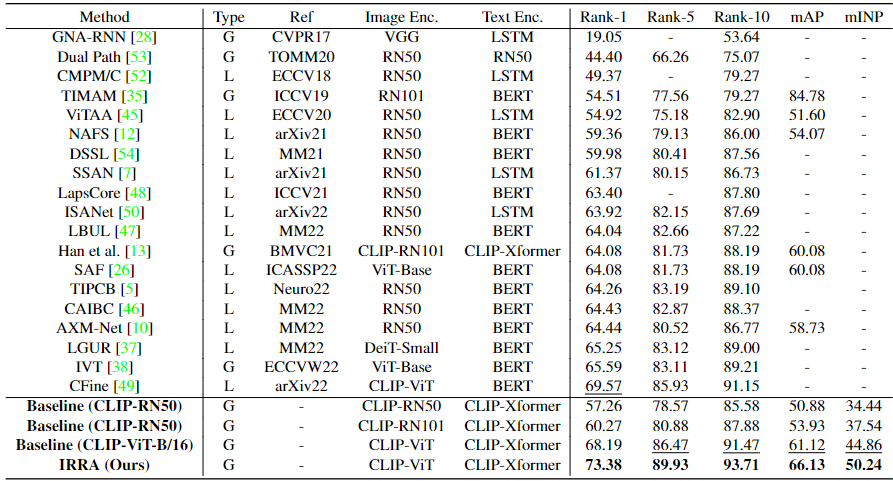
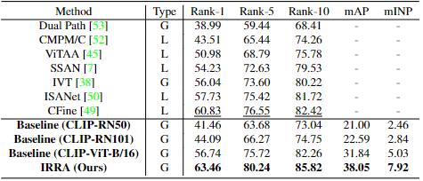
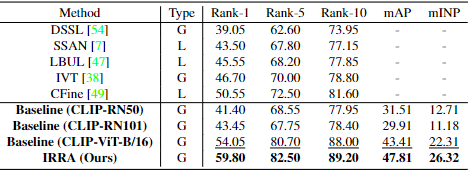

# Cross-Modal Implicit Relation Reasoning and Aligning for Text-to-Image Person Retrieval

Official PyTorch implementation of the paper [Cross-Modal Implicit Relation Reasoning and Aligning for Text-to-Image Person Retrieval]() (CVPR 2023)


## Installation
### Requirements
we use single RTX3090 24G GPU for training and evaluation. 
```
pytorch 1.9.0
torchvision 0.10.0
prettytable
easydict
```

### Prepare Datasets
Download the CUHK-PEDES dataset from [here](https://github.com/ShuangLI59/Person-Search-with-Natural-Language-Description), ICFG-PEDES dataset from [here](https://github.com/zifyloo/SSAN) and RSTPReid dataset form [here](https://github.com/NjtechCVLab/RSTPReid-Dataset)

Organize them in `your dataset root dir` folder as follows:
```
|-- your dataset root dir/
|   |-- <CUHK-PEDES>/
|       |-- imgs
|            |-- cam_a
|            |-- cam_b
|            |-- ...
|       |-- reid_raw.json
|
|   |-- <ICFG-PEDES>/
|       |-- imgs
|            |-- test
|            |-- train 
|       |-- ICFG_PEDES.json
|
|   |-- <RSTPReid>/
|       |-- imgs
|       |-- data_captions.json
```


## Training

```python
python train.py \
--name irra \
--img_aug \
--batch_size 64 \
--MLM \
--loss_names 'sdm+mlm+id' \
--dataset_name 'CUHK-PEDES' \
--root_dir 'your dataset root dir' \
--num_epoch 60
```

## Testing

```python
python test.py --config_file 'logs/CUHK-PEDES/iira/configs.yaml'
```

## Results
### Performance comparisons with state-of-the-art methods on CUHK-PEDES dataset.
<!--  -->


### Performance comparisons with state-of-the-art methods on ICFG-PEDES dataset.


### Performance comparisons with state-of-the-art methods on RSTPReid dataset.


## Citation
If you find this code useful for your research, please cite our paper

## Contact
If you have any question, please feel free to contact us. E-mail: jiangding@whu.edu.cn , yemang@whu.edu.cn
