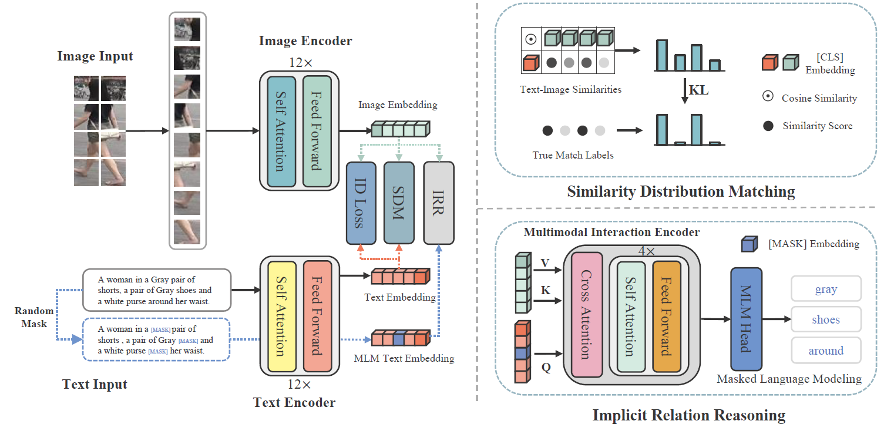

# Cross-Modal Implicit Relation Reasoning and Aligning for Text-to-Image Person Retrieval
[](https://github.com/anosorae/IRRA/blob/main/LICENSE) [](https://paperswithcode.com/sota/nlp-based-person-retrival-on-cuhk-pedes?p=cross-modal-implicit-relation-reasoning-and)

Official PyTorch implementation of the paper Cross-Modal Implicit Relation Reasoning and Aligning for Text-to-Image Person Retrieval. (CVPR 2023) [arXiv](https://arxiv.org/abs/2303.12501)

## Updates
- (3/23/2023) Add arXiv link for our paper.
- (3/18/2023) Add download links of trained models and logs.
- (3/17/2023) Ensure the reproducibility of our code.
- (3/13/2023) Code released!

## Highlights

The goal of this work is to enhance global text-to-image person retrieval performance, without requiring any additional supervision and inference cost. To achieve this, we utilize the full CLIP model as our feature extraction backbone. Additionally, we propose a novel cross-modal matching loss (SDM) and an Implicit Relation Reasoning module to mine fine-grained image-text relationships, enabling IRRA to learn more discriminative global image-text representations.




## Usage
### Requirements
we use single RTX3090 24G GPU for training and evaluation. 
```
pytorch 1.9.0
torchvision 0.10.0
prettytable
easydict
```

### Prepare Datasets
Download the CUHK-PEDES dataset from [here](https://github.com/ShuangLI59/Person-Search-with-Natural-Language-Description), ICFG-PEDES dataset from [here](https://github.com/zifyloo/SSAN) and RSTPReid dataset form [here](https://github.com/NjtechCVLab/RSTPReid-Dataset)

Organize them in `your dataset root dir` folder as follows:
```
|-- your dataset root dir/
|   |-- <CUHK-PEDES>/
|       |-- imgs
|            |-- cam_a
|            |-- cam_b
|            |-- ...
|       |-- reid_raw.json
|
|   |-- <ICFG-PEDES>/
|       |-- imgs
|            |-- test
|            |-- train 
|       |-- ICFG_PEDES.json
|
|   |-- <RSTPReid>/
|       |-- imgs
|       |-- data_captions.json
```


## Training

```python
python train.py \
--name iira \
--img_aug \
--batch_size 64 \
--MLM \
--loss_names 'sdm+mlm+id' \
--dataset_name 'CUHK-PEDES' \
--root_dir 'your dataset root dir' \
--num_epoch 60
```

## Testing

```python
python test.py --config_file 'path/to/model_dir/configs.yaml'
```

## IRRA on Text-to-Image Person Retrieval Results
#### CUHK-PEDES dataset

|     Method      |     Backbone     |  Rank-1   |  Rank-5   |  Rank-10  |    mAP    |   mINP    |
| :-------------: | :--------------: | :-------: | :-------: | :-------: | :-------: | :-------: |
|     CMPM/C      |    RN50/LSTM     |   49.37   |     -     |   79.27   |     -     |     -     |
|      DSSL       |    RN50/BERT     |   59.98   |   80.41   |   87.56   |     -     |     -     |
|      SSAN       |    RN50/LSTM     |   61.37   |   80.15   |   86.73   |     -     |     -     |
|   Han et al.    |  RN101/Xformer   |   64.08   |   81.73   |   88.19   |   60.08   |     -     |
|      LGUR       | DeiT-Small/BERT  |   65.25   |   83.12   |   89.00   |     -     |     -     |
|       IVT       |  ViT-B-16/BERT   |   65.59   |   83.11   |   89.21   |     -     |     -     |
|      CFine      |  ViT-B-16/BERT   |   69.57   |   85.93   |   91.15   |     -     |     -     |
|    **CLIP**     | ViT-B-16/Xformer |   68.19   |   86.47   |   91.47   |   61.12   |   44.86   |
| **IRRA (ours)** | ViT-B-16/Xformer | **73.38** | **89.93** | **93.71** | **66.13** | **50.24** |

[Model & log for CUHK-PEDES](https://drive.google.com/file/d/1OBhFhpZpltRMZ88K6ceNUv4vZgevsFCW/view?usp=share_link)

#### ICFG-PEDES dataset

|     Method      |  Rank-1   |  Rank-5   |  Rank-10  |    mAP    |   mINP   |
| :-------------: | :-------: | :-------: | :-------: | :-------: | :------: |
|     CMPM/C      |   43.51   |   65.44   |   74.26   |     -     |    -     |
|      SSAN       |   54.23   |   72.63   |   79.53   |     -     |    -     |
|       IVT       |   56.04   |   73.60   |   80.22   |     -     |    -     |
|      CFine      |   60.83   |   76.55   |   82.42   |     -     |    -     |
|    **CLIP**     |   56.74   |   75.72   |   82.26   |   31.84   |   5.03   |
| **IRRA (ours)** | **63.46** | **80.24** | **85.82** | **38.05** | **7.92** |

[Model & log for ICFG-PEDES](https://drive.google.com/file/d/1Y3D7zZsKPpuEHWJ9nVecUW-HaKdjDI9g/view?usp=share_link)

#### RSTPReid dataset

|     Method      |  Rank-1   |  Rank-5   |  Rank-10  |    mAP    |   mINP    |
| :-------------: | :-------: | :-------: | :-------: | :-------: | :-------: |
|      DSSL       |   39.05   |   62.60   |   73.95   |     -     |     -     |
|      SSAN       |   43.50   |   67.80   |   77.15   |     -     |     -     |
|       IVT       |   46.70   |   70.00   |   78.80   |     -     |     -     |
|      CFine      |   50.55   |   72.50   |   81.60   |     -     |     -     |
|    **CLIP**     |   54.05   |   80.70   |   88.00   |   43.41   |   22.31   |
| **IRRA (ours)** | **60.20** | **81.30** | **88.20** | **47.17** | **25.28** |

[Model & log for RSTPReid](https://drive.google.com/file/d/1LpUHkLErEWkJiXyWYxWwiK-8Fz1_1QGY/view?usp=share_link)


## Acknowledgments
Some components of this code implementation are adopted from [CLIP](https://github.com/openai/CLIP), [TextReID](https://github.com/BrandonHanx/TextReID) and [TransReID](https://github.com/damo-cv/TransReID). We sincerely appreciate for their contributions.


## Citation
If you find this code useful for your research, please cite our paper.

```tex
@inproceedings{cvpr23crossmodal,
  title={Cross-Modal Implicit Relation Reasoning and Aligning for Text-to-Image Person Retrieval},
  author={Jiang, Ding and Ye, Mang},
  booktitle={IEEE International Conference on Computer Vision and Pattern Recognition (CVPR)},
  year={2023},
}
```

## Contact
If you have any question, please feel free to contact us. E-mail: [jiangding@whu.edu.cn](mailto:jiangding@whu.edu.cn), [yemang@whu.edu.cn](mailto:yemang@whu.edu.cn).
